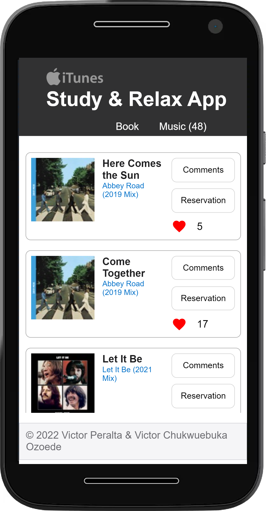

# Capstone Project for JavaScript module
> Study & Relax   
This App gives you a recomendation of JavaScript books to read and also let you hear some music, so you can concentrate and relax while you are studing.  
This App uses the iTunes Searches API, for more information about this API please refer to the [Apple Reference](https://developer.apple.com/library/archive/documentation/AudioVideo/Conceptual/iTuneSearchAPI/index.html)

## Built With

- HTML
- CSS
- Javascript

## Live Demo
[Live demo](https://vicperalta.github.io/Capstone-JavaScript/)

## Mobile

## Tablet

## Desktop

## Getting Started

To get a local copy follow these simple example steps.  

1.- Open the terminal window and clone the repository using this command:  
`git clone git@github.com:VicPeralta/Capstone-JavaScript.git` 

2.- Change the directory to the leaderboard directory  
`cd `  
3.- Install the project's dependencies by running this command:   
`npm install`  
4.- Generate the dist folder using this command:  
`npm run build`  
5.- Open the file `.\dist\index.html` to see the Web Page  
6.- To see the code open the project in the code editor of your preference.  

## Author

👤 **Victor Peralta**
- GitHub: [@VicPeralta](https://github.com/VicPeralta)

👤 **Victor Chukwuebuka Ozoede**
- GitHub: [@chukwuebukaVictor](https://github.com/chukwuebukaVictor)

## 🤝 Contributing

Contributions, issues, and feature requests are welcome!

Feel free to check the [issues page](https://github.com/VicPeralta/to-Do-List/issues).

## Show your support

Give a ⭐️ if you like this project!

## Acknowledgments

- A special thank for @fernandorpm for this amazing [README template](https://github.com/microverseinc/readme-template)

## 📝 License

This project is [MIT](./LICENSE.md) licensed.

